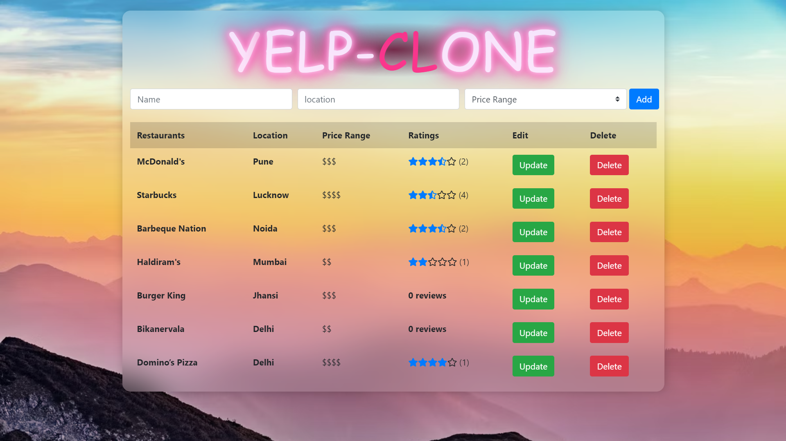

# Yelp-Clone
A Full Stack Yelp Clone using PERN (Postgres, Express, React, Node.js). User scan add/update/delete restaurants and can give review and rating to each restaurant. A list of all restaurants, with their average rating is displayed on the home page.

